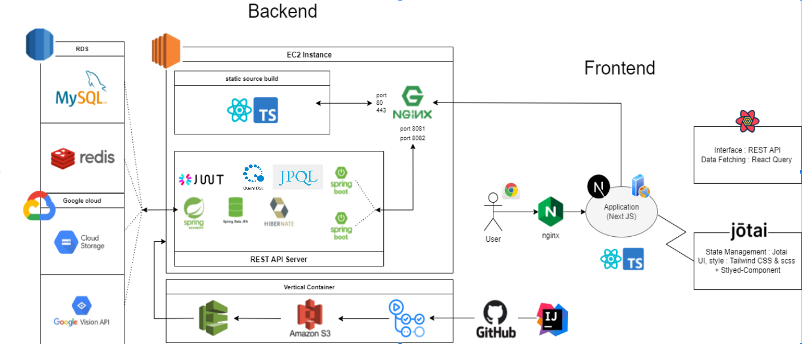

[![Contributors][contributors-shield]][contributors-url]
[![Forks][forks-shield]][forks-url]
[![Stargazers][stars-shield]][stars-url]
[![Issues][issues-shield]][issues-url]
[![MIT License][license-shield]][license-url]

<!-- PROJECT LOGO -->
 

  

<h3 align="center">글 한조각</h3>

  

    오늘의 글 한 조각
함께 음미하고 나눠보세요
     
    <a href="https://github.com/dnd-side-project/dnd-6th-10-a-piece-of-writing"><strong>소개글 »</strong></a>
     
     
    <a href="http://pieceofwriting.kro.kr/">체험하기</a>
    ·
    <a href="https://github.com/dnd-side-project/dnd-6th-10-a-piece-of-writing/discussions">버그 신고</a>
    ·
    <a href="https://github.com/dnd-side-project/dnd-6th-10-a-piece-of-writing/issues">기능 개선에 참여</a>
  

## 글 한조각

### 글귀 공유 플랫폼

좋아하는 문장을 모으고 공유하는 서비스

사람들에게 마음에 와닿는, 따뜻하고 의미 있는 나만의 글귀와 순간의 감정을 모아 놓고, 타인과 공유하며 함께 공감과 위로를 나눌 수 있는 일기장과 같은 플랫폼

### 주요 기능
- 맘에 드는 글귀를 이미지에서 추출하여 예쁜 템플릿에 담아 이미지로 손쉽게 공유하기 위한, **사진 인식 텍스트 추출 기능**
- 수집한 글귀를 손쉽게 분류하여 편리하게 찾기 위한, **글귀 카테고라이징 기능**
- 맘에 드는 글귀의 원문 및 출처를 편리하게 검색하기 위한, **글귀 원문 링크 연결**

## 🗺️아키텍처

## ⚒️ 기술 스택

### Backend
- Development : Java, SpringBoot, IntelliJ, JPA
- Authentication : Spring Security, JWT
- DevOps: Github Action, S3, CodeDeploy, Nginx
- Cloud : AWS EC2
- Test : Junit

### Frontend
- Main Framework : Next JS + TypeScript 
- Data Fetching : React-Query
- State management : Jotai 
- UI Tools : Tailwind CSS, Styled-Component
- Image processing : html2canvas, react-avatar-editor, cropperjs ...

# 📋 컨벤션
## 브랜치 관리 전략
⚙️ github-flow

| 브랜치 종류  | 설명                                                         |
| ------------ | ------------------------------------------------------------ |
| Master(main) | 테스트 서버에서 테스트가 끝나고 운영서버로 배포 할 수 있는 브랜치 |
| feature      | 하나의 기능을 개발하기 위한 브랜치                           |
| release | 이번 출시 버전을 준비하는 브랜치             |

### 참고 자료
1. [Git 브랜칭 전략 : Git-flow와 Github-flow](https://hellowoori.tistory.com/56)
2. [GitHub flow](https://docs.github.com/en/get-started/quickstart/github-flow)

## 브랜치 네이밍
⚙️ 네이밍 패턴

브랜치 종류/(backend,frontend) 간단한 설명

Ex) backend에서 '로그인 기능' 이슈를 구현하는 브랜치를 생성하는 경우, 브랜치 이름을

*feature/backend-Login* 로 작성한다.

*feature/frontend-PostsCard* 로 작성한다.

## 커밋 메시지

**⚙️ Type**

| 타입 종류 | 설명                                 |
| --------- | ------------------------------------ |
| feat      | 새로운 기능에 대한 커밋              |
| fix       | 수정에 대한 커밋                     |
| bug       | 버그에 대한 커밋                     |
| build     | 빌드 관련 파일 수정에 대한 커밋      |
| ci/cd     | 배포 커밋                            |
| docs      | 문서 수정에 대한 커밋                |
| style     | 코드 스타일 혹은 포맷 등에 관한 커밋 |
| refactor  | 코드 리팩토링에 대한 커밋            |
| test      | 테스트 코드 수정에 대한 커밋         |

⚙️ 구조

[Type] 제목 #이슈번호

본문

Ex) 이슈번호가 67인 이슈의 기능을 구현한 뒤 커밋을 하는 상황이라면 커밋 메시지의 제목을

*[feat] A기능 구현 #67* 으로 작성한다.

## 👥 파트 및 개발 계획
### [ 팀원 & 파트 ]
#### 🖥️ 프론트엔드
- 서상혁 [Github](https://github.com/SeoSang)

#### 🗄️ 백엔드
- 신동민 [Github](https://github.com/carnival77)
- 김태경

#### 🎨 디자인
- 김아영
- 송지우

[ 개발 기간 ] 2022/01 ~ 2022/02

📑Notion: https://friendly-chips-ca7.notion.site/10-c7cc990a5a6c4564966e2e72c2a7fe78

## 라이센스

[MIT 라이센스](https://opensource.org/licenses/MIT)

(<a href="#top">맨 위로</a>)

<!-- MARKDOWN LINKS & IMAGES -->
<!-- https://www.markdownguide.org/basic-syntax/#reference-style-links -->
[contributors-shield]: https://img.shields.io/github/contributors/dnd-side-project/dnd-6th-10-a-piece-of-writing.svg?style=for-the-badge
[contributors-url]: https://github.com/dnd-side-project/dnd-6th-10-a-piece-of-writing/graphs/contributors
[forks-shield]: https://img.shields.io/github/forks/dnd-side-project/dnd-6th-10-a-piece-of-writing.svg?style=for-the-badge
[forks-url]: https://github.com/dnd-side-project/dnd-6th-10-a-piece-of-writing/network/members
[stars-shield]: https://img.shields.io/github/stars/dnd-side-project/dnd-6th-10-a-piece-of-writing.svg?style=for-the-badge
[stars-url]: https://github.com/dnd-side-project/dnd-6th-10-a-piece-of-writing/stargazers
[issues-shield]: https://img.shields.io/github/issues/dnd-side-project/dnd-6th-10-a-piece-of-writing.svg?style=for-the-badge
[issues-url]: https://github.com/dnd-side-project/dnd-6th-10-a-piece-of-writing/issues
[license-shield]: https://img.shields.io/github/license/dnd-side-project/dnd-6th-10-a-piece-of-writing.svg?style=for-the-badge
[license-url]: https://github.com/dnd-side-project/dnd-6th-10-a-piece-of-writing/blob/master/LICENSE.txt
[linkedin-shield]: https://img.shields.io/badge/-LinkedIn-black.svg?style=for-the-badge&logo=linkedin&colorB=555
[linkedin-url]: https://linkedin.com/in/linkedin_username
