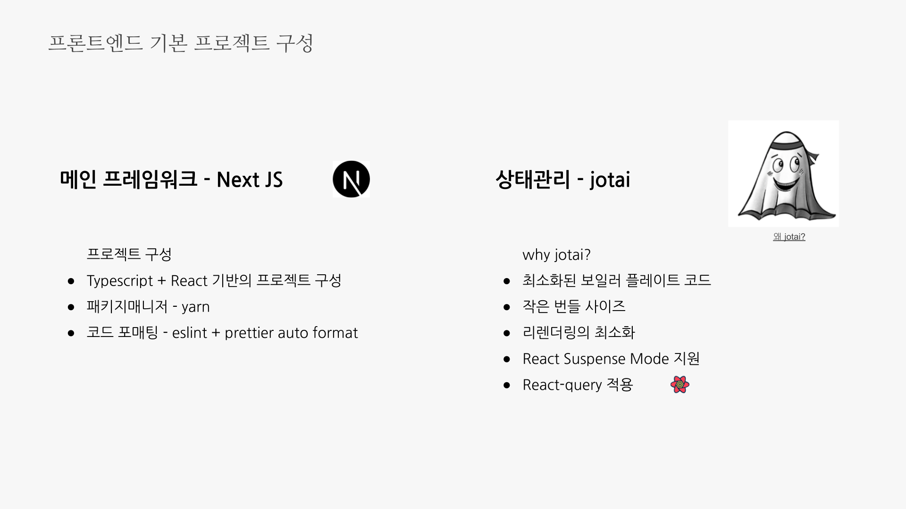
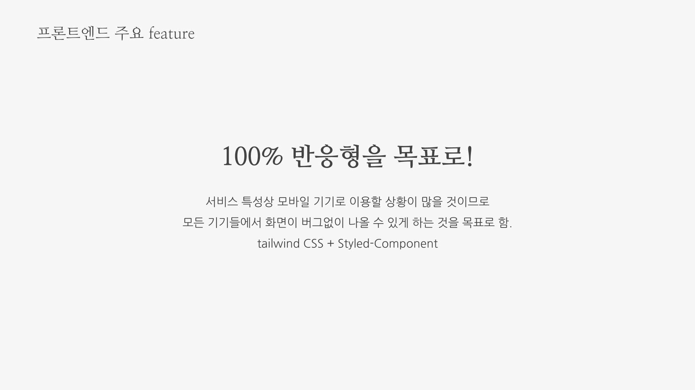
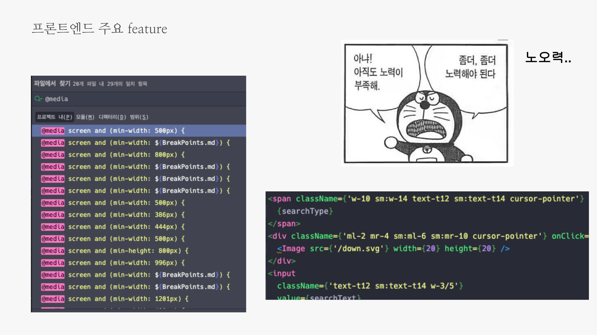
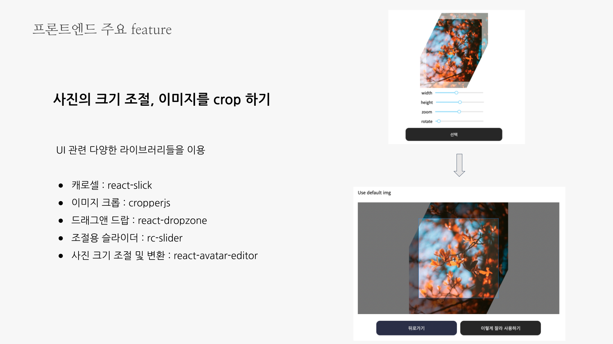
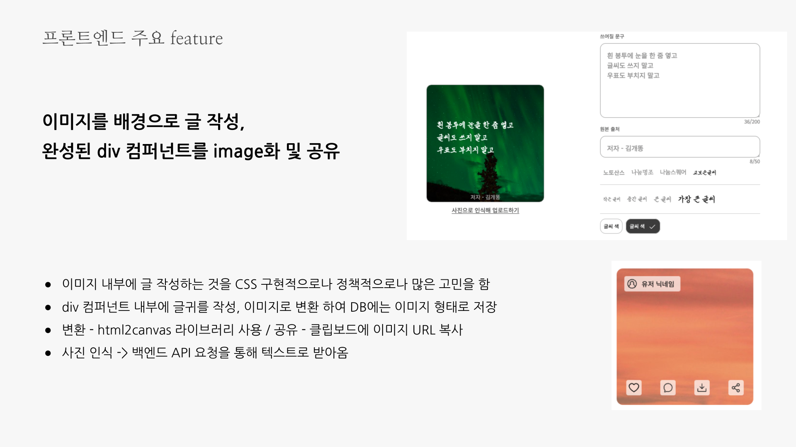

# 프론트엔드

## 주요 feature

- 99% 반응형 구현
  - styled-component media-query 사용
  - tailwind CSS 사용
- 이미지 편집 애플리케이션
  - 유저가 글귀의 배경과 글귀를 커스텀하여 직접 작성하고, 이를 업로드 및 보는 것이 주요 기능이다. 이를 구현하기 위해 div 컴퍼넌트 내부에 글귀를 작성, 이미지로 변환시켜 DB에는 이미지 형태로 저장하도록함
  - cropperjs, react-avatar-editor, html2canvas 등 다양한 라이브러리 사용

## 주요 기술

- 메인 프레임워크 :  Next JS + TypeScript + React
- 패키지 매니저 : yarn
- 코드 포매팅 : eslint + prettier
- 상태관리 : jotai + react-query

## 담당자

- 서상혁 [Github](https://github.com/SeoSang)

## 발표자료

.